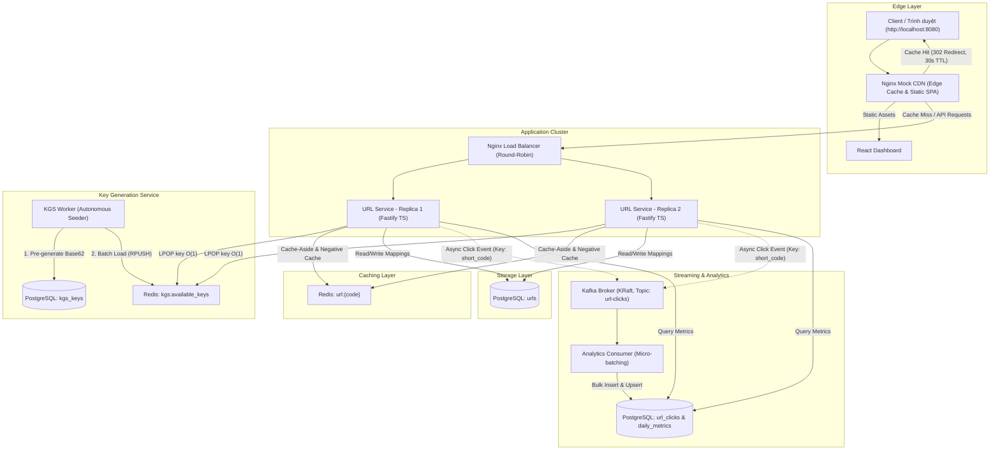

# TinyURL Distributed Architecture System

Hệ thống phân tán URL Shortener mô phỏng thực tế các tầng kiến trúc System Design chuẩn production, chạy hoàn toàn trên môi trường local thông qua Docker Compose.

---

## 🏛️ Kiến Trúc Hệ Thống (Architecture Overview)



---

## 🚀 Các Thành Phần Chính (Components)

1. **Mock CDN (Nginx Edge Proxy)**:
   - Cổng công khai: `http://localhost:8080`.
   - Phục vụ ứng dụng Single Page Application (React + Tailwind CSS).
   - Cache các HTTP 302 Redirects trong 30 giây (`s-maxage=30`) theo quyết định [ADR-0002](docs/adr/0002-edge-caching-for-temporary-redirects.md).
   - Trả về header `X-Cache-Status: HIT/MISS` để kiểm chứng Edge caching.

2. **Load Balancer (Nginx)**:
   - Cân bằng tải Round-Robin nội bộ giữa 2 replicas (`url-service-1:3000` và `url-service-2:3000`).
   - Gắn header `X-Server-Instance` để xác định replica xử lý request.

3. **Key Generation Service (KGS)**:
   - Chạy ngầm độc lập theo [ADR-0001](docs/adr/0001-offline-key-pre-generation.md).
   - Sinh sẵn hàng chục nghìn Base62 keys ngẫu nhiên (7 ký tự) vào PostgreSQL.
   - Tự động nạp từng batch 5.000 keys vào Redis List `kgs:available_keys` bằng câu lệnh an toàn `SELECT ... FOR UPDATE SKIP LOCKED`.
   - URL Service chỉ cần gọi atomic `LPOP` trên Redis để lấy key `O(1)` mà không gây lock database.

4. **URL Service (Fastify + TypeScript - 2 Replicas)**:
   - `POST /api/v1/urls`: Tạo Short URL (hỗ trợ KGS Base62, Custom Alias và Expiration TTL).
   - `GET /{short_code}`: Redirect 302 đến Target URL.
   - **Negative Caching ([ADR-0003](docs/adr/0003-negative-caching-for-penetration-prevention.md))**: Cache mã không tồn tại `"__NOT_FOUND__"` với TTL 60s để ngăn chặn Cache Penetration DoS.
   - Gửi Click Event bất đồng bộ vào Kafka topic `url-clicks`.
   - `GET /api/v1/urls/{code}/analytics`: Truy vấn dữ liệu thống kê aggregated.

5. **Analytics Pipeline (Kafka KRaft + Micro-batching Consumer)**:
   - Apache Kafka 3.7+ chạy chế độ **KRaft** (không cần Zookeeper).
   - Topic `url-clicks` gồm 3 partitions, partition key là `short_code`.
   - Consumer đọc stream theo [ADR-0004](docs/adr/0004-kafka-event-streaming-for-click-analytics.md), gom micro-batch (50 events hoặc 2 giây), phân tích User-Agent (trình duyệt, hệ điều hành, thiết bị) và bulk insert/upsert vào PostgreSQL.

6. **Web Dashboard (React + Tailwind CSS)**:
   - Truy cập trực tiếp tại `http://localhost:8080`.
   - Form rút gọn link (tùy chọn Custom Alias, Expiration).
   - Khung kiểm tra độ trễ Edge CDN & Header Diagnostics.
   - Biểu đồ và bảng thống kê Kafka Analytics cập nhật thời gian thực.

---

## 🛠️ Hướng Dẫn Chạy (Quick Start)

### 1. Khởi động toàn bộ cụm:
```bash
docker compose up -d --build
```

### 2. Kiểm tra trạng thái các container:
```bash
docker compose ps
```

### 3. Truy cập giao diện:
- Mở trình duyệt tại: **`http://localhost:8080`**

---

## 🧪 Kịch Bản Kiểm Thử (Verification Scenarios)

### 1. Tạo Short URL với KGS Key:
```bash
curl -X POST http://localhost:8080/api/v1/urls \
  -H "Content-Type: application/json" \
  -d '{"original_url": "https://en.wikipedia.org/wiki/URL_shortening"}'
```

### 2. Tạo Short URL với Custom Alias:
```bash
curl -X POST http://localhost:8080/api/v1/urls \
  -H "Content-Type: application/json" \
  -d '{"original_url": "https://github.com", "custom_alias": "my-gh-link"}'
```

### 3. Kiểm tra CDN Cache (HIT vs MISS):
```bash
# Lần 1: MISS (chưa có trong cache)
curl -I http://localhost:8080/my-gh-link

# Lần 2 (trong vòng 30s): HIT (trả về trực tiếp từ Nginx CDN với độ trễ < 5ms)
curl -I http://localhost:8080/my-gh-link
```

### 4. Kiểm tra Phòng Thủ Cache Penetration:
```bash
# Request mã không tồn tại
curl -I http://localhost:8080/nonexistent_fake_123

# Kiểm tra Redis: đã lưu negative cache với TTL 60s
docker compose exec redis redis-cli GET url:nonexistent_fake_123
```

### 5. Kiểm tra Kafka Click Analytics:
```bash
curl http://localhost:8080/api/v1/urls/my-gh-link/analytics
```

---

## 📚 Tài Liệu Kiến Trúc & Quyết Định (ADRs & Context)
- [Domain Glossary: CONTEXT.md](CONTEXT.md)
- [Feature Spec: .scratch/url-shortener/spec.md](.scratch/url-shortener/spec.md)
- [ADR 0001: Offline Key Pre-generation (KGS)](docs/adr/0001-offline-key-pre-generation.md)
- [ADR 0002: Edge Caching for Temporary Redirects](docs/adr/0002-edge-caching-for-temporary-redirects.md)
- [ADR 0003: Negative Caching for Penetration Prevention](docs/adr/0003-negative-caching-for-penetration-prevention.md)
- [ADR 0004: Kafka Event Streaming with Micro-batching](docs/adr/0004-kafka-event-streaming-for-click-analytics.md)
