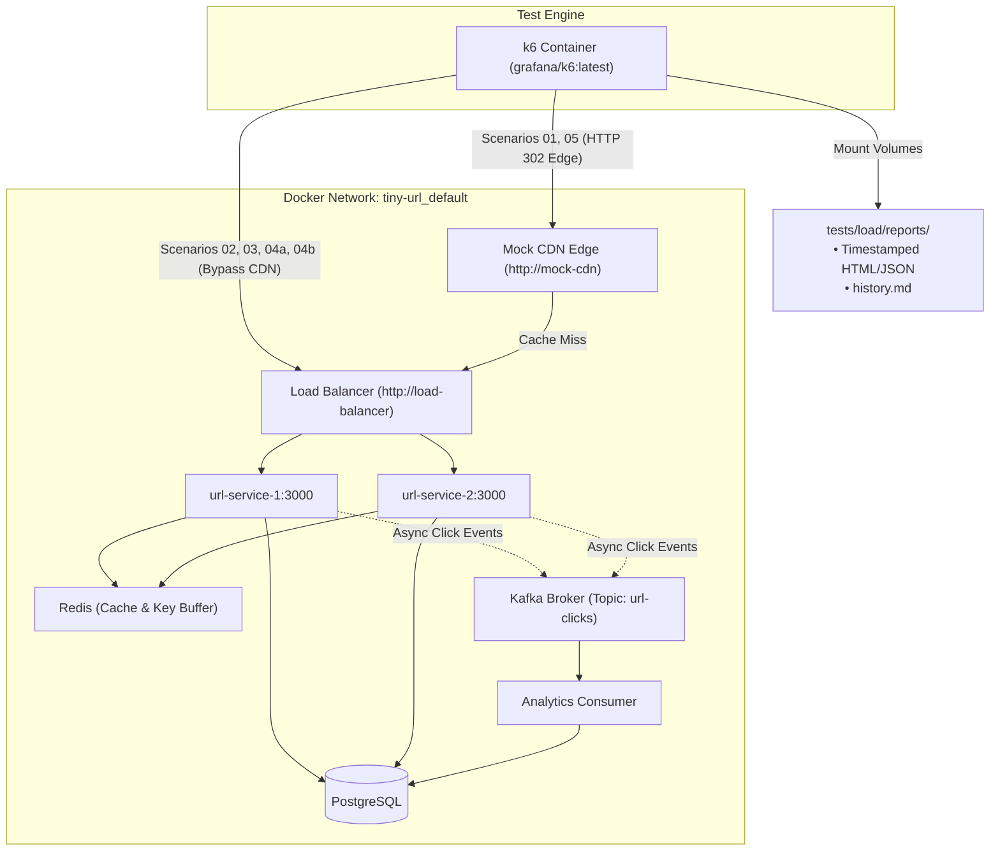

# TinyURL Performance Testing & Benchmark Suite

Bộ công cụ kiểm thử hiệu năng phân tán (Distributed Load Testing Harness) dành cho hệ thống TinyURL, được xây dựng dựa trên **Grafana k6** chạy hoàn toàn trong mạng Docker Compose (`tiny-url_default`). 

Bộ công cụ này đo lường năng lực chịu tải của từng tầng kiến trúc riêng biệt (Edge Cache, Load Balancer, Service Nodes, Redis Cache-Aside, Key Buffer, Kafka Event Streaming và PostgreSQL), tích hợp cơ chế **xuất báo cáo HTML/JSON không bị ghi đè** và **script đối soát dữ liệu pipeline** theo quyết định [ADR-0007](../../docs/adr/0007-containerized-load-testing-and-pipeline-reconciliation.md).

---

## 🏛️ Kiến Trúc Thực Thi (Test Execution Topology)



---

## ⚡ Bảng Ánh Xạ Kiến Trúc (Architecture & ADR Mapping)

Mỗi kịch bản kiểm thử đóng vai trò là bằng chứng thực nghiệm trực tiếp (Living Evidence) kiểm chứng các quyết định thiết kế đã được tài liệu hóa:

| Kịch bản | Lệnh thực thi | Target Ingress | Tầng kiến trúc kiểm thử | Quyết định ADR liên quan |
|---|---|---|---|---|
| **01-hotkey-cache-hit** | `npm run test:load:hotkey` | Mock CDN (`:80`) | Nginx Edge Caching (HTTP 302, `s-maxage=30`) | [ADR-0002](../../docs/adr/0002-edge-caching-for-temporary-redirects.md) |
| **02-origin-cache-miss** | `npm run test:load:origin` | Load Balancer (`:80`) | Fastify Service Nodes + Redis URL Cache-Aside | [ADR-0006](../../docs/adr/0006-sse-and-snapshot-caching-for-observability.md) |
| **03-cache-penetration** | `npm run test:load:penetration` | Load Balancer (`:80`) | Redis Negative Cache (`__NOT_FOUND__`) | [ADR-0003](../../docs/adr/0003-negative-caching-for-penetration-prevention.md) |
| **04a-write-steady** | `npm run test:load:write` | Load Balancer (`:80`) | Key Buffer `LPOP` + Postgres URL Insertion | [ADR-0001](../../docs/adr/0001-offline-key-pre-generation.md) |
| **04b-write-starvation** | `npm run test:load:starvation` | Load Balancer (`:80`) | Key Buffer Starvation & KGS Self-Healing | [ADR-0001](../../docs/adr/0001-offline-key-pre-generation.md), [ADR-0006](../../docs/adr/0006-sse-and-snapshot-caching-for-observability.md) |
| **05-mixed-pipeline** | `npm run test:load:mixed` | CDN + LB | 90% Read + 10% Write + Kafka Event Stream | [ADR-0004](../../docs/adr/0004-kafka-event-streaming-for-click-analytics.md) |
| **Pipeline Audit** | `npm run test:load:verify` | Docker host | Kafka Consumer Lag & Postgres Click Counts | [ADR-0007](../../docs/adr/0007-containerized-load-testing-and-pipeline-reconciliation.md) |

---

## 🎯 Phân Tích Chuyên Sâu Các Kịch Bản (Scenario Deep-Dive)

### 1. `01-hotkey-cache-hit.js` — Edge Cache Saturation
- **Mục tiêu**: Đo trần thông lượng tối đa của tầng Edge Cache (Mock CDN Nginx) khi link trở nên viral.
- **Cơ chế**:
  - `setup()`: Gọi API tạo 1 Short URL mới và gửi 1 request đầu tiên để prime cache (`X-Cache-Status: MISS`).
  - VUs: Bắn tải 100 VUs liên tục trong 25 giây nhắm vào `http://mock-cdn/{code}` với cờ `{ redirects: 0 }`.
  - Kiểm tra (Checks): Header `X-Cache-Status === 'HIT'`, HTTP Status 302, Header `Location` hợp lệ.
- **Baseline thực nghiệm**:
  - **Throughput**: `~96,400 req/s`
  - **Latency p95**: `1.68 ms` | **Tỷ lệ lỗi**: `0.00%`

### 2. `02-origin-cache-miss.js` — Origin Fastify & Cache-Aside Benchmark
- **Mục tiêu**: Bỏ qua hoàn toàn Edge CDN để ép tải trực tiếp vào Load Balancer nội bộ và 2 Service Nodes (`url-service-1`, `url-service-2`), kiểm tra tầng đệm Redis Cache-Aside.
- **Cơ chế**:
  - `setup()`: Tạo trước 50 Short URL ngẫu nhiên và lưu vào danh sách `codes`.
  - VUs: 150 VUs bốc ngẫu nhiên Short Code từ pool để gọi `http://load-balancer/{code}`.
  - Kiểm tra (Checks): HTTP Status 302, Header `X-Server-Instance` hiện diện (xác nhận Round-Robin hoạt động).

### 3. `03-cache-penetration.js` — Cache Penetration Defense
- **Mục tiêu**: Mô phỏng cuộc tấn công dò quét hàng loạt Short Code không tồn tại nhằm làm tê liệt cơ sở dữ liệu PostgreSQL.
- **Cơ chế**:
  - Bắn một tập lặp lại gồm các mã rác (`ghost_key_*`).
  - Lần truy vấn đầu tiên tìm kiếm trong DB không thấy và ghi nhận giá trị `__NOT_FOUND__` vào Redis với TTL 60s.
  - Hàng trăm nghìn request tiếp theo bị chặn đứng ngay tại Redis trong vài mili-giây mà không sinh câu lệnh `SELECT` xuống PostgreSQL.
- **Baseline thực nghiệm**:
  - **Throughput**: `~20,100 req/s`
  - **Latency p95**: `6.03 ms` | **Lỗi 5xx Database**: `0.00%`

### 4. `04a-write-steady.js` — Steady-State Short URL Creation
- **Mục tiêu**: Đo thông lượng tạo Short URL ổn định (`POST /api/v1/urls`) khi **Key Buffer** trong Redis luôn ở trạng thái dồi dào.
- **Cơ chế**:
  - 40 VUs đồng thời gửi payload URL duy nhất.
  - URL Service thực hiện atomic `LPOP` từ Redis `kgs:available_keys` $O(1)$ và insert vào PostgreSQL `urls`.
- **Baseline thực nghiệm**:
  - **Throughput**: `~3,200 req/s` (tạo hơn 80.000 link trong 25 giây)
  - **Latency p95**: `10.26 ms` | **Tỷ lệ lỗi**: `0.00%`

### 5. `04b-write-starvation.js` — Key Buffer Exhaustion & Resilience
- **Mục tiêu**: Bắn tải ghi cực hạn với 120 VUs nhằm rút cạn Key Buffer nhanh hơn chu kỳ nạp 5 giây của KGS Worker, kiểm chứng khả năng tự phục hồi (Self-Healing).
- **Cơ chế**:
  - Khi Key Buffer Depth tụt về 0, URL Service chuyển sang cơ chế fallback sinh chuỗi ngẫu nhiên an toàn mà không làm sập API.
  - `teardown()`: Tự động truy vấn `/api/v1/system/status` để kiểm tra trạng thái phục hồi của KGS Worker.
- **Baseline thực nghiệm**:
  - **Throughput**: `~3,000 req/s`
  - **Hậu kiểm**: KGS tự động kích hoạt `SELECT ... FOR UPDATE SKIP LOCKED` và nạp bù đầy đủ trở lại `~5,000 keys` trong Redis.

### 6. `05-mixed-pipeline-stress.js` — Real-world Traffic & Event Streaming
- **Mục tiêu**: Mô phỏng lưu lượng thực tế theo tỷ lệ **90% Đọc (Redirect) + 10% Ghi (Tạo URL)**, đồng thời đẩy hàng chục nghìn Click Events vào Kafka Broker.
- **Cơ chế**:
  - 10% request tạo link mới qua Load Balancer.
  - 90% request redirect qua Mock CDN kèm User-Agent ngẫu nhiên, kích hoạt `publishClickEvent()` vào Kafka topic `url-clicks`.

---

## 📊 Hệ Thống Báo Cáo Không Bị Ghi Đè (Immutable Reporting)

Mỗi lần thực thi k6, hệ thống **không bao giờ ghi đè** lên kết quả cũ. Thay vào đó:

1. **Báo cáo Giao diện HTML Độc Lập**:
   - Được lưu tại `tests/load/reports/<scenario>-<YYYY-MM-DDTHH-mm-ss>.html`.
   - Tự chứa 100% (nhúng inline CSS, font, không phụ thuộc internet).
   - Hiển thị các thẻ chỉ số KPI, phân phối chi tiết độ trễ HTTP (`min`, `p50`, `avg`, `p90`, `p95`, `p99`, `max`), tỷ lệ lỗi và danh sách Assertions.

2. **Báo cáo Dữ liệu JSON Raw**:
   - Được lưu tại `tests/load/reports/<scenario>-<YYYY-MM-DDTHH-mm-ss>.json`.
   - Chứa toàn bộ time-series metrics dùng cho việc vẽ biểu đồ hoặc import vào các công cụ phân tích khác.

3. **Bảng Lịch Sử Chạy Test Tập Trung ([history.md](./reports/history.md))**:
   - Script `append-history.mjs` tự động nối thêm (append) 1 dòng tóm tắt hiệu năng vào bảng tổng hợp sau mỗi lần chạy test:
   ```markdown
   | `2026-09-22T13-15-30` | **04b-write-starvation** | 120 | 74,858 | 2994.0 | 35.22ms | N/A | 0.00% | [`04b-write-starvation-...html`](./04b-write-starvation-...html) |
   ```

---

## 🔍 Đối Soát Pipeline & Khử Lag Kafka (`npm run test:load:verify`)

Sau khi chạy các bài test Read hoặc Mixed Workload, hàng chục nghìn Click Events được chuyển vào Kafka. Để kiểm tra xem Analytics Consumer có bị thất thoát dữ liệu hoặc tích tụ độ trễ (Lag) hay không, hãy chạy:

```bash
npm run test:load:verify
```

### Script thực hiện các kiểm tra:
1. **Kiểm tra PostgreSQL**: Đếm tổng số Short URLs trong bảng `urls`, tổng số sự kiện thô trong `url_clicks`, và tổng số click đã được gom nhóm tổng hợp trong `url_analytics_daily`.
2. **Kiểm tra Redis Key Buffer**: Kiểm tra độ sâu `Key Buffer Depth` hiện có trong danh sách `kgs:available_keys`.
3. **Kiểm tra Kafka Consumer Lag**: Gọi trực tiếp công cụ `kafka-consumer-groups.sh` bên trong container `tinyurl-kafka`, kiểm tra Lag trên từng partition (0, 1, 2) của topic `url-clicks` thuộc nhóm `analytics-consumer-group`.

**Mẫu kết quả chuẩn (Tất cả hàng đợi đã xả sạch và dữ liệu nhất quán 100%)**:
```
================================================================================
🔍 PIPELINE DATA RECONCILIATION & LAG AUDIT
================================================================================

📊 DATABASE & STORAGE AUDIT
--------------------------------------------------------------------------------
Total Short URLs in DB      : 80,029
Raw Click Events Recorded   : 21
Aggregated Daily Clicks     : 21
Current Key Buffer Depth    : 5,000 keys

⚡ KAFKA CONSUMER LAG AUDIT (Topic: url-clicks, Group: analytics-consumer-group)
--------------------------------------------------------------------------------
Partition 0 : Current=8  | LogEnd=8  | Lag=0
Partition 1 : Current=12 | LogEnd=12 | Lag=0
Partition 2 : Current=1  | LogEnd=1  | Lag=0
--------------------------------------------------------------------------------
Total Consumer Lag : 0 pending events

🛡️  INTEGRITY VERIFICATION RESULT
--------------------------------------------------------------------------------
Pipeline Queue Drained (Lag = 0)       : ✅ PASS
Analytics Aggregation Consistency     : ✅ CONSISTENT
================================================================================
```

---

## 🚀 Hướng Dẫn Vận Hành Nhanh (Quick Start)

### 1. Khởi động toàn bộ cụm TinyURL:
```bash
docker compose up -d
```

### 2. Chạy từng kịch bản kiểm thử:
```bash
# Kiểm tra Edge Cache Hit
npm run test:load:hotkey

# Kiểm tra Origin Fastify & Redis Cache-Aside
npm run test:load:origin

# Kiểm tra Phòng thủ Thâm nhập Cache (Negative Caching)
npm run test:load:penetration

# Kiểm tra Tạo Short URL Ổn định
npm run test:load:write

# Kiểm tra Cạn kiệt Key Buffer & Khả năng Tự phục hồi
npm run test:load:starvation

# Kiểm tra Lưu lượng Hỗn hợp Thực tế & Kafka Streaming
npm run test:load:mixed
```

### 3. Kiểm tra tính toàn vẹn dữ liệu:
```bash
npm run test:load:verify
```

### 4. Xem báo cáo & Lịch sử kiểm thử:
- Mở trực tiếp các file `.html` mới nhất trong thư mục `tests/load/reports/` trên trình duyệt để phân tích:
  - **Khối thông số bài test (Test Specification & Workload Profile)**: Điểm tiếp nhận tải (Target Ingress), tầng kiến trúc kiểm thử, mã ADR đối chiếu, các giai đoạn tải (Stages/VUs), thời lượng chạy và phân loại tải.
  - **Bảng đối soát tiêu chuẩn SLA (SLA & Threshold Criteria)**: Trạng thái Đạt/Vi phạm (`PASS` / `VIOLATED`) của từng ngưỡng hiệu năng (`p95`, `p99`, `fail_rate`).
  - Biểu đồ phân phối độ trễ và các chỉ số đo lường chi tiết.
- File `tests/load/reports/history.md` tự động lập chỉ mục lịch sử chạy với đầy đủ các cột: `Timestamp`, `Scenario`, `Target`, `Duration`, `VUs Max`, `Total Reqs`, `Throughput (RPS)`, `Latency p95`, `Latency p99`, `Fail Rate`, `SLA Status`, `Report File`.

